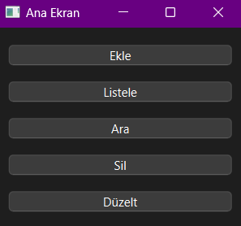
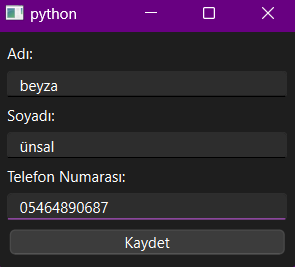
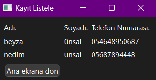
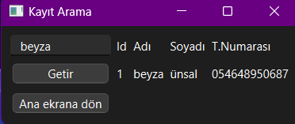
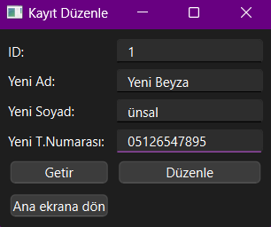
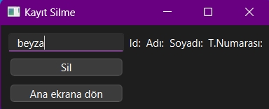

<h1>RehberApp / Rehber Masaüstü Uygulaması</h1>

<b><h4>Rehber AnaMenü </h4></b>

<b><h4>Rehbere Kişi Ekle</h4></b>

<b><h4>Rehberdeki Kişileri Listele </h4></b>

<b><h4>Rehberdeki Kişiyi Ara</h4></b>

<b><h4>Rehberdeki Kişiyi Düzelt</h4></b>

<b><h4>Rehberdeki Kişiyi Sil</h4></b>

