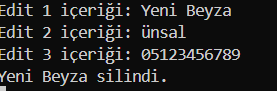

<h1>RehberApp / Rehber Masaüstü Uygulaması</h1>

Rehber uygulaması için PyQt6 ile yazılmış bir masaüstü uygulamasını içeriyor. Kullanıcı, uygulama giriş ekranında "admin" ve "1234" kullanıcı bilgileriyle giriş yaparak rehber üzerinde ekleme, listeleme, arama, silme ve düzeltme işlemlerini gerçekleştirebilmektedir.

<b><h4>Rehber AnaMenü </h4></b>

Karşımıza şifreyi girdikten sonra ana menü ekranı çıkmaktadır. Burada ihtiyacımız olan butona tıklayarak isteğiniz sonuca ulaşabilirsiniz.

<b><h4>Rehbere Kişi Ekle</h4></b>

Masaüstü uygulamamıza bir kişi eklemek istediniz.Sizden istenen adı, soyadı ve telefon bilgileridir. (Telefon numarası rasgele yazılmıştır.)

<b><h4>Rehberdeki Kişileri Listele </h4></b>

Rehberde kayıtlı isimlere veya telefon numaralarına ulaşmak istediğinizde listele butonunu seçmeniz gerekmektedir. Size daha iyi anlatabilmek için ekstra bir kişi daha ekledim. Listele ekranımızda kayıtlı tüm kişileri görebilirsiniz. 

<b><h4>Rehberdeki Kişiyi Ara</h4></b>

Listele ekranından ulaşmak yerinde direkt olarak size lazım olan kişinin telefonuna ulaşmak istersiniz arama butonunu seçin ve istenen bilgiyi doldurun. Burada istediğiniz kişinin adını sormaktadır.

<b><h4>Rehberdeki Kişiyi Sil</h4></b>

<b><h4>Rehberdeki Kişiyi Düzelt</h4></b>

Kayıt düzenleme seçeneğimizde ilk olarak düzleteceğimiz kişinin id adresini öğrenmemiz gerektedir. Listele ekranından bu bilgiye ulaşabilirsiniz. Ardından kişimizin güncel bilgilerini kaydedebilirsiniz.
